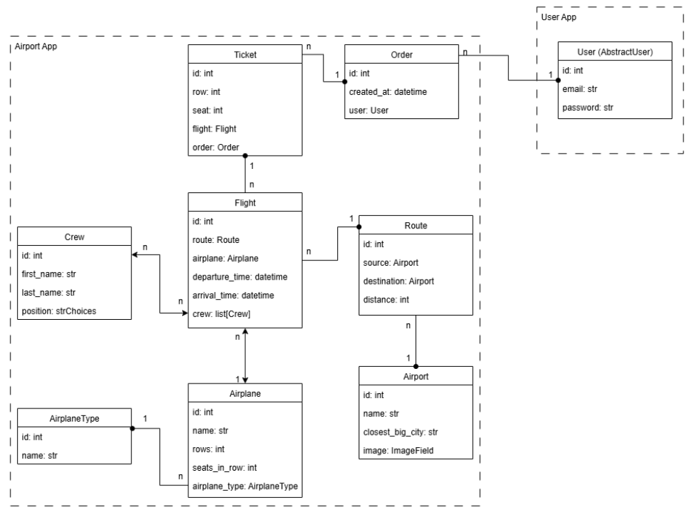

# ✈️ Airport Management System

This is a **DRF based API** for managing an airport system.
It provides functionality for handling airports, airplanes, flights, routes, crews, and ticket orders.  
The project is designed with scalability and maintainability in mind, offering a clear architecture,
well-structured models, and standardized API endpoints.  

## 🌟 Features
- 🔹 User management with registration, JWT authentication and permissions  
- 🔹 CRUD operations for flights, routes, airplanes, crew, airports
- 🔹 Create orders with tickets (users can access only their own orders)  
- 🔹 Role-based access:  
  - Admins → full CRUD access  
  - Authenticated users → read-only (except personal orders)  
- 🔹 API documentation (Swagger)  
- 🔹 Throttling, filtering, pagination
- 🔹 Tests with coverage reporting
- 🔹 Continuous Integration with GitHub Actions

## 💻 Tech Stack
- 🐍 Python 3.12
- 🔧 Django 5.2 + DRF 3.16
- 🐘 PostgreSQL 15.0
- 🐳 Docker

## 🧱 DB Schema


## 🛠 Installation
> ⚠️ **Prerequisites:**  
Make sure that docker is installed on your system.  
You can check with:
>```shell
>docker --version
>```
<br>

1. **Clone the repository:**
```shell
   git clone https://github.com/sosunovych-andrii/task-manager.git
````
2. **Create a .env file in the root directory of the project** and copy the content from .env.sample
replacing the placeholder values with your own:
```shell
  cp .env.sample .env
```
3. **Build and start containers:**
```shell
  docker-compose up --build
```
4. **Open API documentation (Swagger UI) in your browser**
    http://localhost:8000/api/doc/swagger/
> #### 📝Notes:
> To **stop containers use**:
>```shell
>docker-compose stop
>```
> To **load sample data use**:
>```shell
>docker-compose exec django python manage.py loaddata sample_data.json
>```


## 🔐 Demo Login Credentials
Explore the application using the following demo accounts:

| Role   | Email               | Password    |
|--------|---------------------|-------------|
| Admin  | `admin@example.com` | `ytrewq123` |
| User   | `user@example.com`  | `ytrewq123` |

> ⚠️ You can also create your own account via registration endpoint
`POST /api/user/register/`
